# TaskFlow — UI/UX Design Brief & Claude AI Prompting Specification

> **Purpose of this Document**:  
> This comprehensive specification answers all 13 critical product, user experience, and design questions for **TaskFlow** (an Apple iOS HIG-inspired Android task management application). This document is formatted and optimized for **Claude (Anthropic)** to ingest as a context-rich prompt, enabling Claude to generate an industry-grade, master-class UI/UX design system, screen-by-screen architectural overhaul, micro-interaction blueprint, and design tokens documentation.

---

## 🧭 Executive Context for Claude

**Application Name**: TaskFlow  
**Target Platform**: Android 7.0+ (API 24 to 35) built with **Kotlin** & **Jetpack Compose**  
**Core Design Philosophy**: Pixel-perfect **Apple Human Interface Guidelines (HIG)** aesthetic running with maximum native Android performance (120Hz refresh rates, rich haptics, local-first Room SQLite persistence, on-device + Gemini cloud AI schedule optimization, and multi-user biometric security).  
**Repository**: [PrerakPithadiya/android-compose-todo](https://github.com/PrerakPithadiya/android-compose-todo.git)  

---

## 📋 Comprehensive Answers to the 13 Design Questions

### 1. App Purpose: What it does, in 2-3 lines
**TaskFlow** is an authentic iOS-inspired, privacy-first productivity and task management app for Android that blends Apple's clean, minimalist Human Interface Guidelines (HIG) with local-first speed. It empowers individuals and teams to effortlessly capture, categorize, and track daily tasks, plan across multi-view calendars (Month, Week, Agenda), and stay motivated through gamified streaks, XP levels, and Apple Watch-style 3D achievement medals. Furthermore, it incorporates an intelligent hybrid AI schedule optimizer (offline heuristic engine + Google Gemini) that automatically detects calendar collisions, balances cognitive load, and assigns Eisenhower Matrix priorities with zero cloud lock-in.

---

### 2. Target Users: Who they are, their age range, and whether they're tech-savvy
* **Primary Persona**: Knowledge workers, software engineers, university students, product managers, designers, freelancers, and organized achievers aged **18 to 45**.
* **Tech-Savviness**: **Moderate to High**.
  * They expect fluid gesture navigation, 120Hz smooth animations, biometric instant unlock (Face ID / Fingerprint), natural language schedule parsing, and zero latency.
  * They are accustomed to top-tier mobile software (e.g., Things 3, Apple Reminders, Notion, Linear, Craft, Cron).
* **Psychographic & Emotional Drivers**:
  * **Aesthetics-First Android Users**: Users who choose Android devices for hardware flexibility or open ecosystems, but genuinely crave the typographical elegance, calm whitespace, and tactile finesse of iOS.
  * **Overwhelmed Planners**: Users who find Jira/Asana far too heavy and cluttered for personal life, yet find Google Keep or simple checklist apps too primitive.
  * **Privacy & Control Advocates**: Users who demand that their data stays on their device in local SQLite databases, protected by biometric app locks without mandatory corporate cloud sync.

---

### 3. Category
* **Primary Category**: **Productivity & Task Management / Personal Organization**.
* **Secondary Categories**:
  * **Daily Planner & Calendar Time-Blocking** (Month, Week, Agenda views).
  * **Self-Improvement & Habit Gamification** (XP leveling system, active streaks, Apple Fitness-style achievement medals, Bento analytics).
  * **Security & Utility** (Biometric vault, dynamic launcher icons, world timezones).

---

### 4. Personality: 3 adjectives for how it should feel
1. **Refined (Apple-Native & Premium)**:
   * Meticulously crafted using Apple's Human Interface Guidelines. Feels like an official first-party Apple application ported natively to Android.
   * Defined by inset grouped card containers (`12dp` radius), SF/Inter typography hierarchy, subtle `0.5dp` hairline dividers, translucent blur surfaces, and subtle tactile haptic clicks.
2. **Calm (Distraction-Free & Frictionless)**:
   * Visually serene and uncluttered. Uses generous whitespace, soft grouped backgrounds (`#F2F2F7` light, `#000000` OLED dark), and thoughtful information hierarchy to actively diminish task anxiety and cognitive fatigue.
   * Tasks feel manageable rather than overwhelming.
3. **Empowering (Intelligent & Dynamic)**:
   * Delights the user through micro-interactions: satisfying circular checkbox strike-through animations, +50 XP badges, glowing 3D fitness medals, and one-tap AI schedule optimization that resolves overlapping chaos into a crystal-clear daily plan.

---

### 5. Brand Colors and Logo
* **Primary Accent Color**:
  * **Apple System Blue** (`#007AFF` Light, `#0A84FF` Dark). Represents focus, trust, precision, and authentic iOS lineage.
* **User-Customizable 8-Color Apple HIG Accent Palette**:
  The app allows users to personalize their entire interface theme through 8 curated Apple system accents:
  1. **System Blue**: Light `#007AFF`, Dark `#0A84FF`, Container `#E5F1FF`
  2. **iOS Purple**: Light `#AF52DE`, Dark `#BF5AF2`, Container `#F5E8FF`
  3. **System Pink**: Light `#FF2D55`, Dark `#FF375F`, Container `#FFE5EA`
  4. **Sunset Orange**: Light `#FF9500`, Dark `#FF9F0A`, Container `#FFF3E0`
  5. **System Green**: Light `#34C759`, Dark `#30D158`, Container `#E8F8ED`
  6. **System Yellow**: Light `#FFCC00`, Dark `#FFD60A`, Container `#FFFBE6`
  7. **System Indigo**: Light `#5856D6`, Dark `#5E5CE6`, Container `#EEEEFF`
  8. **System Teal**: Light `#30B0C7`, Dark `#40C8E0`, Container `#E6F7FA`
* **Canvas & Surface Palette Tokens**:
  * **Light Theme**:
    * Canvas / Grouped Background: `#F2F2F7` (Apple System Grouped Background)
    * Inset Card Surface: `#FFFFFF` (Solid Crisp White)
    * Secondary Card Fill: `#F9F9FB`
    * Primary Text: `#000000` (100% Opacity)
    * Secondary Text: `#3C3C43` (60% Alpha)
    * Tertiary / Strikethrough Text: `#3C3C43` (30% Alpha)
    * Dividers: `#3C3C43` (29% Alpha, `0.5dp` thickness)
    * Search Bar Fill: `#767680` (12% Alpha)
  * **Dark Theme (Pure OLED Black)**:
    * Canvas / Grouped Background: `#000000` (True Black)
    * Inset Card Surface: `#1C1C1E` (Apple System Dark Elevated Surface)
    * Secondary Surface Fill: `#2C2C2E`
    * Primary Text: `#FFFFFF` (100% Opacity)
    * Secondary Text: `#EBEBF5` (60% Alpha)
    * Tertiary / Strikethrough Text: `#EBEBF5` (30% Alpha)
    * Dividers: `#545458` (65% Alpha)
    * Search Bar Fill: `#767680` (24% Alpha)
* **Logo & App Icon System**:
  * **Icon Glyph**: Signature Apple circular checkmark glyph centered on a soft squircle background.
  * **8 Dynamic Launcher Icons** (via Android `<activity-alias>`):
    * *Classic iOS* (System Blue gradient `#007AFF` to `#0055D4`)
    * *Dark Minimal* (Deep graphite `#2C2C2E` to `#121214` with silver border)
    * *Neon Blue Glow* (Midnight navy `#0D1326` with electric cyan glow `#00F0FF`)
    * *Glassmorphism* (Apple chromatic aurora gradient `#6C5CE7` -> `#FD79A8` -> `#74B9FF`)
    * *Sunset Coral* (California twilight `#FF5E3A` to `#FF2A68`)
    * *Emerald Mint* (Apple Health green `#34C759` to `#00A86B`)
    * *Royal Purple* (Ultraviolet `#AF52DE` to `#5856D6`)
    * *Champagne Gold* (Luxe gold `#F3A152` on dark graphite)

---

### 6. Reference Apps: 2-3 apps whose look you admire, and what you like about them
1. **Apple Reminders (iOS 17/18) & Apple Notes**:
   * *What we admire*: Clean Inset Grouped lists (`12dp` radius), 4-tile Smart Summary Grid (Today, Scheduled, All, Flagged), collapsible Large Title headers during scroll, and hairline dividers indented after checkbox icons (`left = 56dp`).
2. **Things 3 (Cultured Code)**:
   * *What we admire*: Unmatched typographic balance, intentional breathing room, frictionless task creation, subtle circular completion rings that fill satisfyingly, and zero unnecessary visual chrome.
3. **Cron / Notion Calendar**:
   * *What we admire*: Ultra-crisp time-blocking, minimal density modes, high-contrast dark theme legibility, and intuitive transitions between Day, Week, and Month views.
4. **Apple Fitness / Apple Watch Activity**:
   * *What we admire*: Glossy 3D achievement badges, Bento grid analytics, concentric progress rings, and celebratory feedback upon hitting daily streaks.

---

### 7. What Feels Wrong: Specific things that bother us now
* **1. Touch Ergonomics & FAB Clash with Bottom Navigation**:
  * Currently, the Home Screen features both a fixed 4-tab bottom navigation bar (`72dp` height) and a floating circular FAB (`+`) positioned at the bottom-right. On devices with Android gesture navigation bars or smaller screens, this FAB crowds the bottom bar, obscures list content, and deviates from native iOS conventions.
  * *Desired Fix*: Integrate task creation into a native iOS bottom toolbar, a dedicated navigation bar action, or a Things 3-style docked Magic Plus Button.
* **2. Modal Sheet Layout Density on Small Screens**:
  * `CreateTaskBottomSheet` and `EditTaskBottomSheet` contain title, notes, priority chips, date/time pickers, category dropdowns, and AI badges. On standard phones, users must scroll excessively inside a half-expanded modal sheet, which clashes with drag-to-dismiss gestures.
  * *Desired Fix*: A cleaner, stepped or progressive-disclosure bottom sheet with auto-expanding fields, compact inline icon toggles, and seamless keyboard avoidance.
* **3. Motion & Spring Physics Missing True iOS Elasticity**:
  * While Compose animations exist, bottom sheets, dialog transitions, and list reorderings currently use standard linear/tween curves instead of authentic Apple iOS spring curves (`dampingRatio = Spring.DampingRatioLowBouncy`, `stiffness = Spring.StiffnessMediumLow`).
  * When tasks are completed, they instantly jump to the bottom. It needs a slight delay, smooth spatial reordering, and tactile micro-confetti/ring expansion.
* **4. Empty States & Visual Delight**:
  * Empty category screens and zero-task states currently display plain text without engaging Apple-styled SF-symbol-like vector artwork, inspirational micro-copy, or one-tap starter suggestions.
* **5. Card Elevation & Border Contrast in Dark Mode**:
  * In OLED dark mode, `#1C1C1E` cards against `#000000` background sometimes blend together on mid-range LCD screens. We need subtle hairline borders (`0.5dp` `#545458` or subtle gradient strokes) to preserve crisp card separation.

---

### 8. Most Important Screens: The 3-5 screens users spend the most time on
1. **Home Screen (Daily Command Center)**:
   * Sticky Large Title header ("Tasks") with user profile avatar, integrated iOS search field (`#767680` 12% fill), and glowing AI Sparkle button (`✦`).
   * "Today's Status" Bento Card displaying tasks remaining, date, and animated circular completion ring.
   * "TaskFlow Intelligence" summary banner with 1-tap schedule optimizer.
   * Inset Grouped Task List featuring circular checkboxes, task titles, category badges, time tags, and priority dots.
2. **Interactive Calendar Screen**:
   * Segmented control toggle: **Month**, **Week**, and **Agenda** views.
   * Horizontal week/day scroller with indicator dots representing task workload.
   * Chronologically arranged time-block agenda (AM/PM) with category filter pills and completed tasks docked at the bottom.
3. **Lists & Smart Categories Screen**:
   * Apple Reminders-style 4-cell Smart Filter Grid (**Today**, **Scheduled**, **All**, **Completed**) with real-time numeric badges and color-coded icons.
   * User Category Cards (Work, Personal, Health, Study, etc.) showing active task count, total tasks, and completion progress bars.
   * Floating "Add List" sheet with color wheel and custom symbol pickers.
4. **Task Creation & Editing Sheet (Modal Bottom Sheet)**:
   * Frictionless text input with natural language date parsing ("tomorrow at 4pm #work urgent").
   * Interactive segmented chips for Priority: **🔴 High (P1)**, **🟡 Medium (P2)**, **🔵 Low (P3)**.
   * Cupertino-style Wheel Time Picker and iOS Date Picker.
   * Category selector and dynamic exact-time notification toggle.
5. **Profile & Gamification Hub**:
   * Hero identity card with Apple "Move & Scale" photo editor and customizable Memojis.
   * Focus Status selector (`🎯 Deep Work`, `⚡ In the Flow`, `🚀 Shipping Code`, `☕ Coffee Break`).
   * XP Level progress bar, active streak flame counter, and 7-day consistency visualizer.
   * 8 collectible 3D Fitness-style achievement medals with detailed inspect sheets.
   * Biometric App Lock setup sheet and Multi-Account profile switcher.

---

### 9. Main User Flow: Core journeys

```mermaid
flowchart TD
    subgraph Flow1["1. Quick Capture & Task Completion Flow"]
        A1["Open App"] --> A2["Instant Biometric / Local SQLite Resume"]
        A2 --> A3["Glance at Home Bento: Remaining Tasks & Ring"]
        A3 --> A4["Tap 'Add Task' (+)"]
        A4 --> A5["Type: 'Deploy hotfix tomorrow 10am #work urgent'"]
        A5 --> A6["Natural Language Parser auto-selects Date, Time, Category & High Priority"]
        A6 --> A7["Save -> Task renders in Inset Grouped List"]
        A7 --> A8["User checks circular toggle -> Haptic Click, Strikethrough & +50 XP Reward"]
    end

    subgraph Flow2["2. AI Schedule Optimization Flow"]
        B1["User has 6+ scattered tasks with time collisions"] --> B2["Tap 'TaskFlow Intelligence' (✦)"]
        B2 --> B3["BottomSheet opens: Local Engine / Gemini analyzes schedule"]
        B3 --> B4["Presents visual diff: Resolved time collisions, Eisenhower Matrix priorities, buffer breaks"]
        B4 --> B5["User reviews -> Taps 'Apply Schedule to All Tasks'"]
        B5 --> B6["SQLite & System Reminders sync instantly"]
    end

    subgraph Flow3["3. Time-Blocking Calendar Flow"]
        C1["Switch to Calendar Tab"] --> C2["Select 'Week' or 'Agenda' View"]
        C3["Filter by Category: 'Work'"] --> C4["Tap unassigned hour slot"]
        C4 --> C5["Assign task -> Scheduled reminder queued in AlarmManager"]
    end
```


---

### 10. Platform Scope & Display Adaptability
* **Primary Scope**: Android Smartphones (Portrait orientation, API 24 to 35).
  * Edge-to-edge layout with full compliance for system status bar and gesture navigation insets.
  * Support for camera cutouts, punch holes, and dynamic islands.
* **Secondary Scope (Foldables & Tablets)**:
  * Adaptive master-detail layouts for wide screens / unfolded displays (e.g. Galaxy Z Fold, Pixel Fold, Pixel Tablet).
  * Left-hand persistent navigation sidebar; right-hand dual pane showing task list alongside calendar agenda or task detail inspector.
* **Theme Modes**:
  * **Mandatory Dual-Mode**: System Auto, Explicit Light Mode, Explicit Dark Mode.
  * Light: `#F2F2F7` grouped background with `#FFFFFF` cards.
  * Dark: Authentic OLED Pure Black `#000000` with `#1C1C1E` cards and hairline borders.

---

### 11. Language, Region, and Internationalization
* **Current Language**: English (US / Global default).
* **Internationalization (i18n)**:
  * Architecture is built on centralized string resources (`res/values/strings.xml`) ready for localization into Spanish, French, German, Japanese, and Hindi.
* **RTL (Right-to-Left) Readiness**:
  * All Compose layouts utilize `start` and `end` alignment modifiers, allowing full bidirectional mirroring for Arabic/Hebrew.
* **Time & Date Localization**:
  * Supports both 12-hour (AM/PM) and 24-hour military clock standards via `TimePreferencesManager`.
  * Integrated World Timezone picker (`TimezonePickerBottomSheet`) with automated airport code lookup (NYC, LON, TYO, DXB, etc.).

---

### 12. Special Needs, Offline Architecture, and Accessibility
* **100% Offline-First Architecture**:
  * **Zero Cloud Dependency**: The entire app operates flawlessly without an internet connection. All user profiles, tasks, categories, and security credentials reside in on-device Room SQLite.
  * **Dual AI Optimizer**: If offline, the deterministic `LocalScheduleOptimizer` runs heuristic time-blocking directly on the device with zero latency. If online, it leverages Google Gemini 1.5/2.0 Flash for deeper reasoning.
* **Accessibility (WCAG 2.1 AAA / AA)**:
  * **Minimum Touch Targets**: All buttons, circular check toggles, and chips strictly enforce minimum `48dp x 48dp` touch bounding boxes.
  * **High Contrast**: Primary typography meets a 21:1 contrast ratio against card backgrounds; secondary labels maintain >4.5:1.
  * **Dynamic Font Scaling**: All text styles use `sp` units and support Android system font scale accessibility up to 150% without clipping.
  * **Screen Reader (TalkBack)**: Descriptive semantic labels (`contentDescription`), `Role.Checkbox` semantics, and state change announcements.
* **Tactile Accessibility**:
  * Multi-tiered haptic engine (`HapticManager` with Light, Medium, and Strong vibration profiles) offering physical confirmation for visually impaired users.

---

### 13. Constraints: What MUST NOT Change
1. **Apple iOS Human Interface Guidelines (HIG) Mandate**:
   * The app’s primary value proposition and signature identity is its **Apple iOS HIG aesthetic**. Inset grouped cards (`12dp` radius), hairline dividers (`0.5dp`), Apple SF font sizing, circular checkboxes, and Cupertino-style sheets are non-negotiable core design tenets.
2. **Local-First SQLite & Multi-User Data Isolation**:
   * Data storage must remain strictly local-first with Room SQLite. Multi-user isolation (`userId` foreign keys) and hashed credential verification must not be bypassed or replaced by cloud-only architectures.
3. **Hardware Biometric Security & App Lock Engine**:
   * The multi-modal security architecture (4-digit/6-digit PIN with custom iOS numeric keypad, custom Pattern Lock canvas, Fingerprint, and Apple Face ID vector UI) must remain intact.
4. **Android Activity-Alias Dynamic App Icon Switching**:
   * Dynamic launcher icon switching using Android `<activity-alias>` must be preserved, ensuring seamless integration with notification status icons (`ic_notification_check`).
5. **Tech Stack & Implementation Feasibility**:
   * All design solutions must be natively implementable in **Kotlin**, **Jetpack Compose**, and **Material 3 / Custom Canvas**. No web views or cross-platform compromise.

---

## 🎨 Design System Quick Reference (Tokens & Layout)

```
+-------------------------------------------------------------------------+
|                          APPLE (iOS HIG) TOKENS                         |
+-----------------------------------+-------------------------------------+
| Light Canvas:  #F2F2F7            | Dark Canvas:   #000000 (OLED Black) |
| Light Surface: #FFFFFF            | Dark Surface:  #1C1C1E              |
| Secondary Fill:#F9F9FB            | Dark Elevated: #2C2C2E              |
| Primary Text:  #000000 (100%)     | Dark Text:     #FFFFFF (100%)       |
| Secondary Text:#3C3C43 (60%)      | Dark Subtitle: #EBEBF5 (60%)        |
| Hairline Line: #3C3C43 (29%, 0.5dp)| Dark Divider:  #545458 (65%, 0.5dp) |
| Search Fill:   #767680 (12%)      | Dark Search:   #767680 (24%)        |
| Primary Accent:#007AFF (Sys Blue) | Dark Accent:   #0A84FF (Sys Blue)   |
| Corner Radius: Inset Card = 12dp  | Bottom Sheet:  Top Corners = 28dp   |
| Search Bar:    Corner = 10dp      | Pill Chips:    Corner = 20dp        |
+-----------------------------------+-------------------------------------+
```

---

## 🚀 Prompt Instructions for Claude

> **Instructions for Claude**:
> Using the exhaustive answers and specifications detailed above, please generate a **comprehensive, production-ready UI/UX Design System & Experience Redesign Document** for TaskFlow. 
>
> Your response should provide:
> 1. **Component Design System**: Exact layout specifications, states (Default, Pressed, Focused, Disabled, Completed), padding, elevation, and typography for:
>    - Inset Grouped Task Cards & Inset Dividers (`left = 56dp`).
>    - Circular Animated Checkbox Toggles.
>    - iOS Large Title Collapsible Top Navigation Bar with Integrated Search.
>    - Translucent Frosted Glass Bottom Navigation Bar & Ergonomic Floating Task Action.
>    - Modal Bottom Sheets (Quick Add, Task Edit, and AI Optimizer) with progressive disclosure.
> 2. **Screen-by-Screen Layout Specifications**: Complete UI wireframe breakdowns for:
>    - Screen 1: Home Dashboard (Today's Tasks, Bento Status, Intelligence Card).
>    - Screen 2: Interactive Calendar (Month, Week, Agenda multi-mode switcher).
>    - Screen 3: Lists & Smart Folders (4-tile Smart Summary Grid + Category Cards).
>    - Screen 4: Quick Task Creation / Editing Sheet (NLP parsing, Priority Chips, Wheel Pickers).
>    - Screen 5: Profile & Gamification Hub (Memoji Hero Card, XP Progress, 3D Medals, Bento Stats).
> 3. **Motion, Physics & Micro-Interactions**:
>    - Spring physics parameters (`stiffness`, `dampingRatio`) for modal sheets, checkbox completion strikethrough, and list reordering.
>    - Haptic feedback mapping (Light click on toggle, Medium on sheet open, Heavy on task delete).
> 4. **Dark Mode & Accessibility Guidelines**:
>    - Contrast validation, TalkBack accessibility tags, minimum touch targets (`48dp`), and dynamic text handling.
> 5. **Tablet & Foldable Adaptations**:
>    - Responsive Master-Detail layout recommendations.
